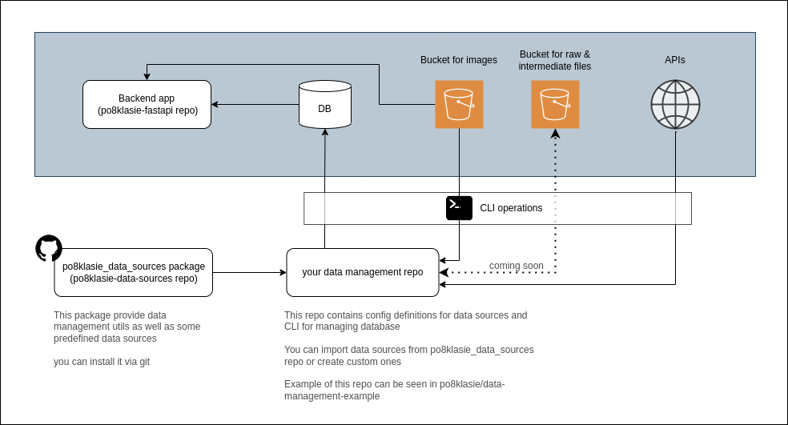

# po8klasie-data-sources

This repo provides utils for data ingestion and managing db.

By decoupling data processing/ingestion from backend repo:
* backend code could be easily deployed by anyone anywhere without many code modifications/creating forks
* complexity of managing data available on different instances is reduced

## Data management flow



## Key concepts

### project

Project is a way to group data together. Usually - one project per city. eg. "po8klasie warszawa", "po8klasie gdynia"

### data source
Data source is single atomic element of data ingestion

### environment
Environment is a single deployment/instance of backend app/db.

Chosen environment impacts:
* db credentials (different for different environments)
* intermediate files' directory (directories for each environment are separate, could be overriden)
* data source configs (specifying different data processing params depending on environment)


### environment config
Data processing could be parametrized to behave differently based on environment

You should provide environment name to config module mapping when invoking `DataManager`

Environment config contains:
* db connection string
* project configs
* data sources' configs
* intermediate files path

### intermediate files
Sometimes files are too large to eg. query an API and put files directly to db. 
Intermediate files are introduced as kind of cache layer between pulling data from source and putting them to db.
Having this kind of local cache comes in handy when playing locally with backend.

I'm thinking about using S3 or GCP buckets instead of local file system for storing intermediate files but for now IMHO there's no need for that

Ultimately data ingestion for each *data source* should look like this:
1. Creating intermediate files (pulling data from API/somewhere)
2. Creating records (from intermediate files)

Data sources which rely on rarely changing inputs (spreadsheets processed by pandas etc) or manually edited data
may skip this step. (You still should check out processed files to the repo)

Intermediate files should not be checked out to data-manager repo

## Getting started

### Installation

**Using poetry (recommended)**

`poetry add git+https://github.com/po8klasie/po8klasie-data-sources`

**Using pip**

`pip install git+https://github.com/po8klasie/po8klasie-data-sources`

> Note: As project is in early stage, we do not follow sem ver

## Setup

You can find example of data-manager repo [here](https://github.com/po8klasie/data-management-example)

Because project is in early stage, example repo can become outdated quickly. 
We'll be doing best we can to make sure it's always up-to-date, but that may not always be the case. 
We're sorry about that.

### Setting up data_manager.py file

```python
#!/usr/bin/env python3
from po8klasie_data_sources.lib.data_manager import DataManager
from po8klasie_data_sources.data_sources.rspo.data_source import RspoDataSource
from po8klasie_data_sources.data_sources.osm_public_transport_info.data_source import OSMPublicTransportInfoDataSource

data_sources = [
    # you can add here data sources imported from this repo
    # or provide custom ones (warning: unstable API)
    RspoDataSource,
    OSMPublicTransportInfoDataSource
]

config_modules = {
    # environment to config module mapping
    'local': 'po8klasie_data_management_example.config.local'
}

data_manager = DataManager(
    data_sources=data_sources,
    config_modules=config_modules
)

if __name__ == "__main__":
    data_manager.init_cli(__file__)
```

### Config modules

Idea of config module is similar to django's settings.py file

Config module must include variables:
* `INTERMEDIATE_FILES_DIR` - intermediate files dir path relative to `data-manager.py` file
* `PROJECT_CONFIGS` - project configs structured like below
* `<uppercased data source id>_DATA_SOURCE_CONFIG` variables for each data source (always a dict)
  * this dict may include `disable` property (bool) to disable data source

> NOTE: You can use env vars here. They'll be loaded based on selected environment

Example:
```python
INTERMEDIATE_FILES_DIR = "./data/intermediate_files/local"

PROJECT_CONFIGS = [
    {
        'project_id': 'gdynia',
        'project_name': 'Gdynia'
    },
]

RSPO_DATA_SOURCE_CONFIG = {
    'borough_names_per_project': {
        'gdynia': ['gdynia']
    }
}

OSM_PUBLIC_TRANSPORT_INFO_DATA_SOURCE_CONFIG = {
    'stop_distance_from_institution': 250
}
```

## CLI usage

Run CLI commands using `poetry run ./data-manager.py ...`

Order of running commands:
0. (`drop_db`)
1. `create_db_schema`
2. `init_projects`
3. `create_intermediate_files`
4. `create_records`

Order of data sources used to create intermediate files/records also matter.
For now, it's not possible to recreate records from single data source.
IDK if we would want that anytime soon, bc of relatively little time to regenerate all db and usage of intermediate files

### database utils

#### `drop_db`
Drop whole database

Flags: 
* `-e <environment>`, `--environment <environment>`, `local` by default

#### `create_db_schema`
Create database schema


Flags: 
* `-e <environment>`, `--environment <environment>`, `local` by default

### projects

#### `init_projects`
Initialize projects. You need to init projects as first step after creating db schema

### data sources

#### `create_intermediate_files <data source, ...>`

Flags: 
* `-e <environment>`, `--environment <environment>`, `local` by default

Create intermediate files. 

You can provide multiple data sources (their ids) separated by whitespace.

You can also pass `__all__` as data source to create intermediate files for all data sources.

TODO: Allow tagging data sources with custom labels and running `create_intermediate_files __<custom label>__` to only create files for data sources with given label.

#### `create_records <data source, ...> `

Flags: 
* `-e <environment>`, `--environment <environment>`, `local` by default
* `--override-intermediate-files-dir <environment>` create records based on intermediate files directory of different environment

Create intermediate files. 

You can provide multiple data sources (their ids) separated by whitespace.

You can also pass `__all__` as data source to create intermediate files for all data sources.

TODO: Allow tagging data sources with custom labels and running `create_intermediate_files __<custom label>__` to only create files for data sources with given label.

#### `regenerate_db`

Flags: 
* `-e <environment>`, `--environment <environment>`, `local` by default
* `--override-intermediate-files-dir <environment>` create records based on intermediate files directory of different environment

Alias for:
1. `drop_db`
2. `create_sb_schema`
3. `init_projects`
4. `create_records __all__`

This command passes `--environment` flag to all commands it invokes.
`--override-intermediate-files-dir` flag is passed to `create_records` command.

## Writing own data sources

Beware: API is not stable.

## Linter, formatter, tests

Linter: `poetry run black .`
Formatter: `poetry run flake8`
Tests: TODO
